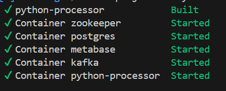
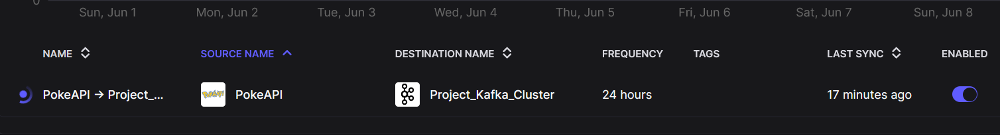
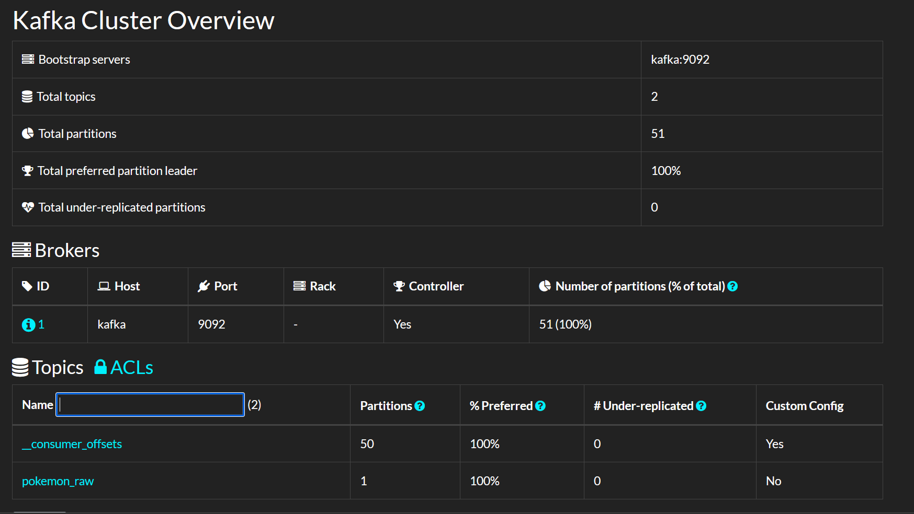
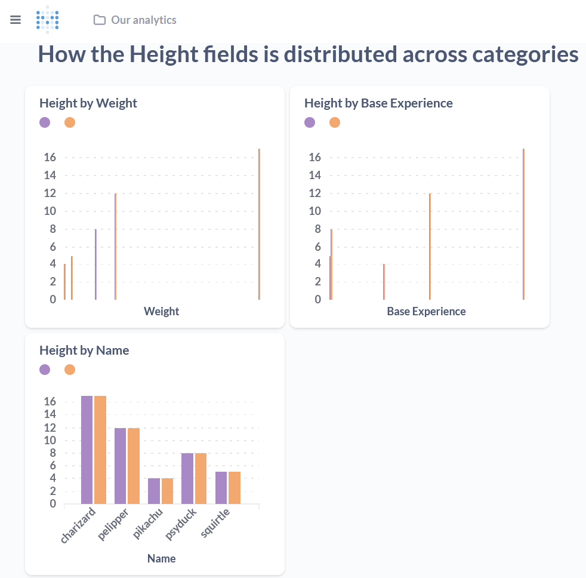

# Data Streamer

## Final Architecture

```plaintext
(YPC)
    │
    ├─ port 8000: Airbyte UI
    ├─ port 9001: Kafdrop UI
    └─ port 3000: Metabase UI

    
                   ┌───────────────┐
                   │External Source|
                   └───────┬───────┘
                           │
                           ▼
┌────────────────────────────────────────────────────────────────────────┐
│                        DATA PLATFORM (DOCKER)                          │
│                                                                        │
│   ┌───────────────┐      ┌───────────────┐      ┌──────────────────┐   │
│   │    Airbyte    │      │     Kafka     │      │      Python      │   │
│   │ (Ingestion)   ├─────►│  (Streaming)  ├─────►│     (Process/    |   |
|   |               |      |               |      |  Transformation) |   │   
│   └───────────────┘      └───────┬───────┘      └─────────┬────────┘   │
│                                  │                        │            │
│  ┌────────────────────────┐      │                        │            │
│  │ Zookeeper (for Kafka)  │◄─────┘                        │            │
│  └────────────────────────┘                               │            │
│                                                           │            │
│                                                           ▼            │
│                                                     ┌──────────────┐   │
│                                                     │  PostgreSQL  │   │
│                                                     │  (Storage)   │   │
│                                                     └──────┬───────┘   │
│                                                            │           │
└────────────────────────────────────────────────────────────┼───────────┘
                                                             │
                                                             ▼
                                                       ┌────────────┐
                                                       │  Metabase  │ (BI/Analysis)
                                                       └────────────┘
```

## 🛠️ Core Components

| Service          | Container Name     | Image/Build                           | Purpose                                                 |
| :--------------- | :----------------- | :------------------------------------ | :------------------------------------------------------ |
| **Zookeeper**    | `zookeeper`        | `confluentinc/cp-zookeeper:7.3.0`     | Manages Kafka cluster state.                          |
| **Kafka**        | `kafka`            | `confluentinc/cp-kafka:7.4.0`         | The central streaming backbone for all data.            |
| **Kafdrop**      | `kafdrop`          | `obsidiandynamics/kafdrop:latest`     | A web UI for monitoring Kafka topics and messages.      |
| **Airbyte**      | (via `abctl`)      | `kindest/node:v1.32.2`                | Ingests data from sources (e.g., REST APIs).          |
| **PostgreSQL**   | `postgres`         | `postgres:15-alpine`                  | A robust relational database to store the final data.   |
| **Python Sink**  | `python-processor` | Custom `build`                        | Consumes from Kafka, processes, and writes to Postgres. |
| **Metabase**     | `metabase`         | `metabase/metabase:v0.49.8` (example) | A user-friendly BI tool for visualization.              |

## 🚀 Getting Started: Step-by-Step Guide

### Prerequisites
*   [Docker](https://www.docker.com/products/docker-desktop/) and Docker Compose
*   A terminal/command line (like PowerShell or Git Bash on Windows)
*   [abctl](https://docs.airbyte.com/platform/using-airbyte/getting-started/oss-quickstart) for running Airbyte

### Step 1: Project Setup

1.  Create the project directory and the necessary sub-directory for  custom Python code.
    ```bash
    mkdir -p data-streamer/python-processor
    cd data-streamer
    ```

2.  Create the following files inside the `python-processor` directory: `process_and_sink.py`, `requirements.txt`, and `Dockerfile`.

3.  Create the main `docker-compose.yml` file in the project root.

### Step 2: Populate Project Files

#### `docker-compose.yml`
This file defines all core infrastructure services.


#### `python-processor/Dockerfile`
This file builds custom Python service image.

#### `python-processor/requirements.txt`
Dependencies for Python script.

```
kafka-python
psycopg2-binary
```

#### `python-processor/process_and_sink.py`

Custom sink logic.

### Step 3: Launch the Infrastructure

1.  **Start Airbyte:** If it's not already running, start it in a separate terminal.
    ```bash
    abctl up
    ```

2.  **Start the Data Platform:** Open a terminal in the `data-streamer` directory and run:
    ```bash
    docker-compose up -d --build
    ```
    This will build ycustom Python image and start all services.

### Step 4: Configure the Pipeline (One-Time Setup)

#### A. Configure the Airbyte Source (REST API)

1.  Navigate to the Airbyte UI at `http://localhost:8000`.
2.  Go to **Sources -> + New source**.
3.  Search for and select the generic **"REST API"** connector.
4.  Configure it as follows:
    *   **Source name**: `Pokemon_Bulk_API`
    *   **Base URL**: `https://pokeapi.co/api/v2/`
    *   Under **Define streams**, click **Add**:
        *   **Name**: `pokemon`
        *   **Path**: `pokemon`
    *   **Record Selector**: Click **Add**:
        *   **Field name**: `results`
    *   **Pagination Strategy**: `Offset Increment`
        *   **Page Size**: `20`
        *   **Inject Limit into... Parameter Name**: `limit`
        *   **Inject Offset into... Parameter Name**: `offset`
5.  Click **Set up source**.

#### B. Configure the Airbyte Destination (Kafka)

1.  Go to **Destinations -> + New destination**.
2.  Select **Kafka**.
3.  Configure it as follows:
    *   **Destination name**: `Project_Kafka_Cluster`
    *   **Bootstrap Servers**: `host.docker.internal:9094` (This uses the dedicated listener we created).
    *   **Topic Pattern**: `pokemon_raw`
    *   **Enable Idempotence**: Toggle **ON** (`true`).
4.  Click **Set up destination**.

#### C. Create the Connection

`PokeAPI` as the source and `Project_Kafka_Cluster` as the destination.


### Step 5: Run and Verify the Pipeline

1.  **Clean the Topic (Optional but good practice for a fresh run):**
    ```bash
    # Delete old topic
    docker exec -it kafka kafka-topics --delete --topic pokemon_raw --bootstrap-server kafka:9092
    # Re-create it
    docker exec -it kafka kafka-topics --create --topic pokemon_raw --bootstrap-server kafka:9092 --partitions 1 --replication-factor 1
    ```

2.  **Run the Sync:** In the Airbyte UI, go to yconnection and click **Sync now**.

3.  **Watch the Logs:** In yterminal, watch the Python sink do its work.
    ```bash
    docker-compose logs -f python-processor
    ```

4.  **Verify in PostgreSQL:**
    ```bash
    docker exec -it postgres psql -U user -d pokemon_db -c "SELECT count(*) FROM public.pokemon_details;"
    ```

### Step 6: Visualize the Data in Metabase

1.  Navigate to Metabase at `http://localhost:3000`.
2.  Complete the initial setup and connect to the PostgreSQL database:
    *   **Host**: `postgres`
    *   **Port**: `5432`
    *   **Database name**: `pokemon_db`
    *   **Username**: `user`
    *   **Password**: `password`
3.  Go to **+ New -> Question**, select ydatabase and the `pokemon_details` table, and start exploring ydata!


# Project Images






